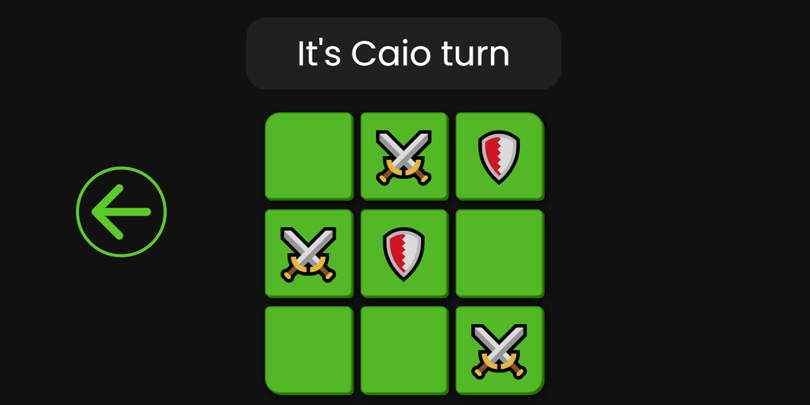

  
  
  # Tic-Tac-Toe
  
  One of the most world famous game!
  

###

  <h2>Desktop</h2>
  
  

  
   ## Play modes:
  
  <ul>
    <li> 2 players</li>
  </ul>

  
  ## Features: 

  <ul>
    <li>Two inputs for players name.</li>
    <li>Winner name it's write on display after game over.</li>
    <li>"Reset" button.</li>
    <li>"Back" button.</li>
  </ul>

 

  
## Extra:

  <i>Find the easter egg...</i>

  

  <h1>
    <a href="https://cmoraes5.github.io/Tic-Tac-Toe/"><b>Play</b></a>
  </h1>

